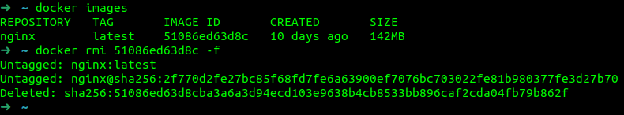

## Part 1. Ready-made docker

##### Take the official docker image from nginx and download it using docker pull.

"docker search nginx" to find the nginx image.

"docker pull nginx" to download nginx image.

##### Check for the docker image with docker images

"docker images" to check existing docker images.

51086ed63d8c - id

##### Run docker image with `docker run -d [image_id|repository]`

"docker run -d 51086ed63d8c"

##### Check that the image is running with `docker ps`

##### View container information with `docker inspect [container_id|container_name]`

"docker inspect %container_id%"

##### From the command output define and write in the report the container size, list of mapped ports and container ip

"docker inspect %container_id% | grep ShmSize" to see container size

"docker inspect %container_id% | grep -n ExposedPort" to know string number(147)

"docker inspect %container_id% | awk '(NR == 148)'" to see next string with port number(148)

"docker inspect %container_id% | grep IPAddress"

##### Stop docker image with `docker stop [container_id|container_name]`
##### Check that the image has stopped with `docker ps`

##### Run docker with mapped ports 80 and 443 on the local machine with *run* command

"docker run -d -p 80:80 -p 443:443 %image_id%"

##### Check that the **nginx** start page is available in the browser at *localhost:80*

##### Restart docker container with `docker restart [container_id|container_name]`
##### Check in any way that the container is running

## Part 2. Operations with container

##### Read the *nginx.conf* configuration file inside the docker container with the *exec* command

##### Create a *nginx.conf* file on a local machine
##### Configure it on the */status* path to return the **nginx** server status page
##### Copy the created *nginx.conf* file inside the docker image using the `docker cp` command
##### Restart **nginx** inside the docker image with *exec*
##### Check that *localhost:80/status* returns the **nginx** server status page

"docker cp %container_id%:/etc/nginx/conf.d/default.conf ./" - copy default .conf file to local machine

"docker exec %container_id% rm /etc/nginx/conf.d/default.conf" - delete default .conf file

"docker cp nginx.conf %container_id%:/etc/nginx/conf.d/nginx.conf" - copy edited .conf file to container

"docker exec %container_id% nginx -s reload" - reloading server

"curl localhost:80/status" - to check that all works

##### Export the container to a *container.tar* file with the *export* command
##### Stop the container

##### Delete the image with `docker rmi [image_id|repository]`without removing the container first

##### Delete stopped container

##### Import the container back using the *import* command
##### Run the imported container
##### Check that *localhost:80/status* returns the **nginx** server status page

